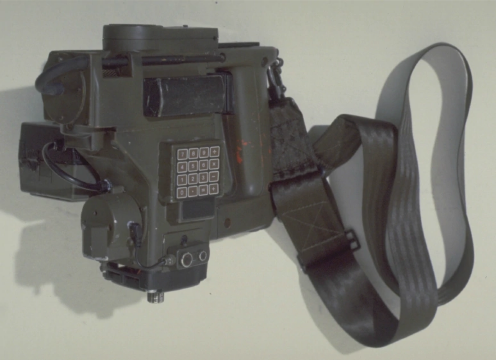

<!-- PROJECT SHIELDS -->

[![Contributors][contributors-shield]][contributors-url]
[![Forks][forks-shield]][forks-url]
[![Stargazers][stars-shield]][stars-url]
[![Issues][issues-shield]][issues-url]
[![MIT License][license-shield]][license-url]
[![LinkedIn][linkedin-shield]][linkedin-url]

<!-- PROJECT LOGO -->
 

  

  <h3 align="center">M314 Motion Tracker (multitool)</h3>

  

    A semifunctional replica of the M314 Motion Tracker from the Aliens franchise. 
     
    <a href="https://github.com/zenmetsu/M314-motion-tracker-multitool"><strong>Explore the docs »</strong></a>
     
     
    <a href="https://github.com/zenmetsu/M314-motion-tracker-multitool">View Demo</a>
    ·
    <a href="https://github.com/zenmetsu/M314-motion-tracker-multitool/issues">Report Bug</a>
    ·
    <a href="https://github.com/zenmetsu/M314-motion-tracker-multitool/issues">Request Feature</a>
  

<!-- TABLE OF CONTENTS -->

  
<h2 style="display: inline-block">Table of Contents</h2>

  <ol>
    <li>
      <a href="#about-the-project">About The Project</a>
      <ul>
        <li><a href="#built-with">Built With</a></li>
      </ul>
    </li>
    <li>
      <a href="#getting-started">Getting Started</a>
      <ul>
        <li><a href="#prerequisites">Prerequisites</a></li>
        <li><a href="#installation">Installation</a></li>
      </ul>
    </li>
    <li><a href="#usage">Usage</a></li>
    <li><a href="#roadmap">Roadmap</a></li>
    <li><a href="#contributing">Contributing</a></li>
    <li><a href="#license">License</a></li>
    <li><a href="#contact">Contact</a></li>
    <li><a href="#acknowledgements">Acknowledgements</a></li>
  </ol>

<!-- ABOUT THE PROJECT -->
## About The Project

[![Product Name Screen Shot][product-screenshot]](https://example.com)

This is a work in progress and the project is in a very early stage.  The goal is to build a semi-functional replica of the M314 Motion Tracker from the Aliens franchise with opensource code and design files.  The software will eventually be modular to permit one to leave out sensors and peripherals that are deemed superfluous.

I have built several multitools in the past; devices which contain a wide array of sensors that can be useful in many situations.  The main components for this project is as follows:

### Mainboard(s)
*  Sparkfun STM32 Thing Plus

### Display(s)
*  ST7735 - 160x128 LCD

### Core Sensors
*  RPLidar A1M8 - LASER SLAM Unit
*  MTK3333 - GPS/GLONASS Receiver
*  ICM-20948 - IMU [Accelerometer/Gyro/Magnetometer]
*  MS8607 - [Pressure/Humidity/Temperature]
*  MLX90640 - 32x24 Thermal Imaging Array

### Software Used

*  vim XD
*  Arduino IDE
*  Blender

<!-- GETTING STARTED -->
## Getting Started

Don't.  This project is in a rapid state of flux as it has just been initiated.  Photos/videos to come.

### Prerequisites

I am using Bodmer's TFT_eSPI library to drive the display.  
Additionally, I am relying upon the RPLidar library put out by RoboPeak

### Installation

Figure it out... it's an Arduino project FFS...

<!-- ROADMAP -->
## Roadmap

See the [open issues](https://github.com/zenmetsu/M314-motion-tracker-multitool/issues) for a list of proposed features (and known issues).

Currently, I am working on the user interface and basic input/output systems.  

I have a 16-key SPI keypad which will be integrated with the device as well.  

Once my 3D Printer is back online, I will print up the casing that I modeled in Blender.  Pending confirmation that the .stl files are adequate, I will post them in this repo.

Additionally, I plan on adding a USB-C charging port, an internal 1000mAH LiPo 1S pack to power the unit when the main battery, a 2200mAH 3S pack, is removed during a battery swap.

<!-- CONTRIBUTING -->
## Contributing

Contributions are what make the open source community such an amazing place to learn, inspire, and create. Any contributions you make are **greatly appreciated**.

1. Fork the Project
2. Create your Feature Branch (`git checkout -b feature/AmazingFeature`)
3. Commit your Changes (`git commit -m 'Add some AmazingFeature'`)
4. Push to the Branch (`git push origin feature/AmazingFeature`)
5. Open a Pull Request

<!-- LICENSE -->
## License

Distributed under the MIT License. See `LICENSE` for more information.

<!-- CONTACT -->
## Contact

Jason Westervelt - [@KF7IJB](https://twitter.com/KF7IJB) - jason.westervelt@protonmail.com

Project Link: [https://github.com/zenmetsu/M314-motion-tracker-multitool](https://github.com/zenmetsu/M314-motion-tracker-multitool)

<!-- MARKDOWN LINKS & IMAGES -->
<!-- https://www.markdownguide.org/basic-syntax/#reference-style-links -->
[contributors-shield]: https://img.shields.io/github/contributors/zenmetsu/M314-motion-tracker-multitool?style=for-the-badge
[contributors-url]: https://github.com/zenmetsu/M314-motion-tracker-multitool/graphs/contributors
[forks-shield]: https://img.shields.io/github/forks/zenmetsu/M314-motion-tracker-multitool?style=for-the-badge
[forks-url]: https://github.com/zenmetsu/M314-motion-tracker-multitool/network/members
[stars-shield]: https://img.shields.io/github/stars/zenmetsu/M314-motion-tracker-multitool?style=for-the-badge
[stars-url]: https://github.com/zenmetsu/M314-motion-tracker-multitool/stargazers
[issues-shield]: https://img.shields.io/github/issues/zenmetsu/M314-motion-tracker-multitool?style=for-the-badge
[issues-url]: https://github.com/zenmetsu/M314-motion-tracker-multitool/issues
[license-shield]: https://img.shields.io/github/license/zenmetsu/M314-motion-tracker-multitool?style=for-the-badge
[license-url]: https://github.com/zenmetsu/M314-motion-tracker-multitool/blob/main/LICENSE.txt
[linkedin-shield]: https://img.shields.io/badge/-LinkedIn-black.svg?style=for-the-badge&logo=linkedin&colorB=555
[linkedin-url]: https://linkedin.com/in/zenmetsu
